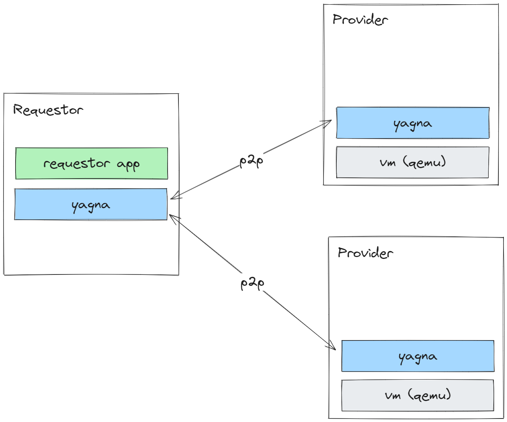
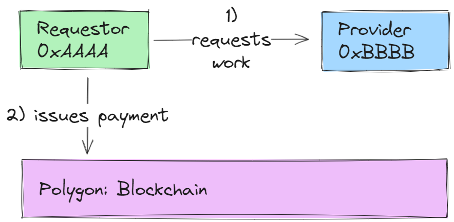
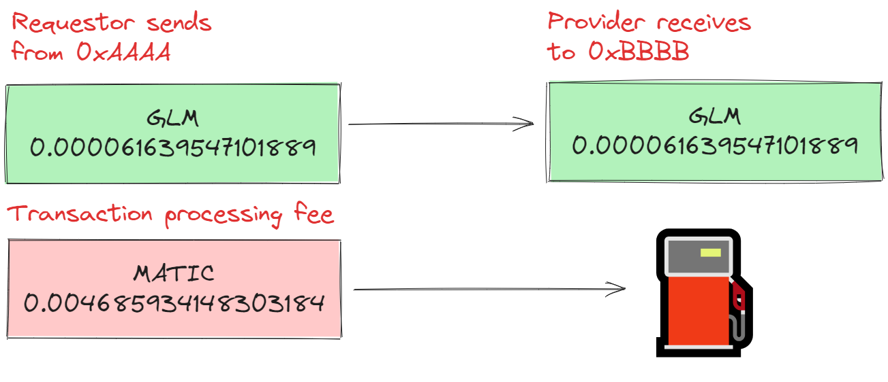

# Golem Network

#### Rozpraszanie zadań obliczeniowych na wiele procesorów

---

# Grzegorz Godlewski

- GitHub: https://github.com/grisha87
- LinkedIn: https://www.linkedin.com/in/ggodlewski/
- Twitter: https://twitter.com/GGodlewski
- Discord: `ggodlewski`
- Mail: [grzegorz@golem.network](mailto:grzegorz@golem.network)

---

# Agenda

- O projekcie Golem Network
- Przykłady zastosowań
- Deep dive
- Sesja Q&A

---

# Czym jest Golem Network?

> Golem **democratizes** society’s access to computing power by creating a **decentralized** platform where anyone can build a variety of applications, request computational resources and/or offer their idle systems in exchange for cryptocurrency tokens (GLM).

---

# Czym jest Golem Network?

- Jest rozwiązaniem OpenSource
- Decentralizacja i wolność dostępu są podstawowymi wartościami

---

# Disclaimer

Mówimy tutaj o tokenach ERC20 (_tokenach krypto_), ale uwaga:

> Przekazywane w trakcie tej prezentacji informajce nie mogą być traktowane jako porada inwestycyjna lub wiążąca ocena rynku albo instrumentu inwestycyjnego.

---

---

# Przykładowe zastosowania

- Wsadowe przetwarzanie dźwięku i obrazu
- Praca na dużych zestawach anomizowanych, lub pseudonimizowanych danych

---

# Klucz do sukcesu

1. Odpowiednia analiza problemu
2. Podział na zadania, które mogą być wykonywane w współbieżnie

---

# Jaki jest stan projektu na dzisiaj?

[https://stats.golem.network](https://stats.golem.network)
[https://portal.golem.network](https://portal.golem.network)
Discord ➡ `#golem-projects`

---

# Dlaczego dla mnie?

---

# User Story

> As a user,
> I want to provide my unused computing power,
> so that I can get some of that power back later

---

# Przykład 1: Hello World

---

# Przykład 2: Własny skrypt

---

# Przykład 3: Scatter-gather

---

# Przykład 4: Utility - konwersja obrazu na tekst

---

# Przykład 5: A frontend?

---

# Jak to jest zrobione?

---

---

---

---

# Jak zacząć jako twórca?

1. Zacznij od instalacji SDK:
   `npm i @golem-sdk/golem-js`

2. Przeczytaj handbook aby poznać Golem
   [https://handbook.golem.network/](https://handbook.golem.network/)

3. Przeczytaj dokumentację dla developerów JS
   [https://docs.golem.network/docs/creators/javascript/quickstarts/quickstart](https://docs.golem.network/docs/creators/javascript/quickstarts/quickstart)

4. Zapoznaj się z przykładami w repozytorium
   [https://github.com/golemfactory/golem-js/tree/master/examples](https://github.com/golemfactory/golem-js/tree/master/examples)

5. Dołącz do naszego [serwera Discord](https://chat.golem.network/),
   SDK ➡ `#js-discussion`

---

# Wybrane ograniczenia

- Różna jakość providerów, fault handling i resiliency konieczne
- Providerzy mają różnej jakości łącza internetowe

---

# Nad czym pracujemy

- Dostęp do internetu z poziomu providera
- Toolchain ułatwiający tworzenie aplikacji na Golem
- Kanały dystrybucji: `latest`, `beta`, `alpha`
- Polityka dotycząca zgodności wstecznej

---

# Pytania?

---

# Zasoby

---

# Dziękuję!
