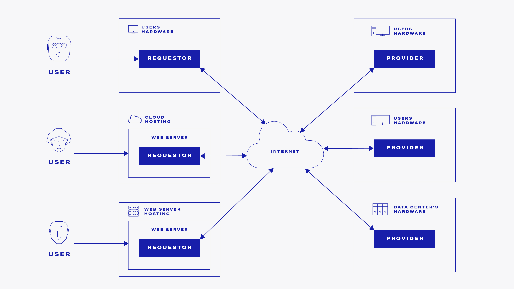
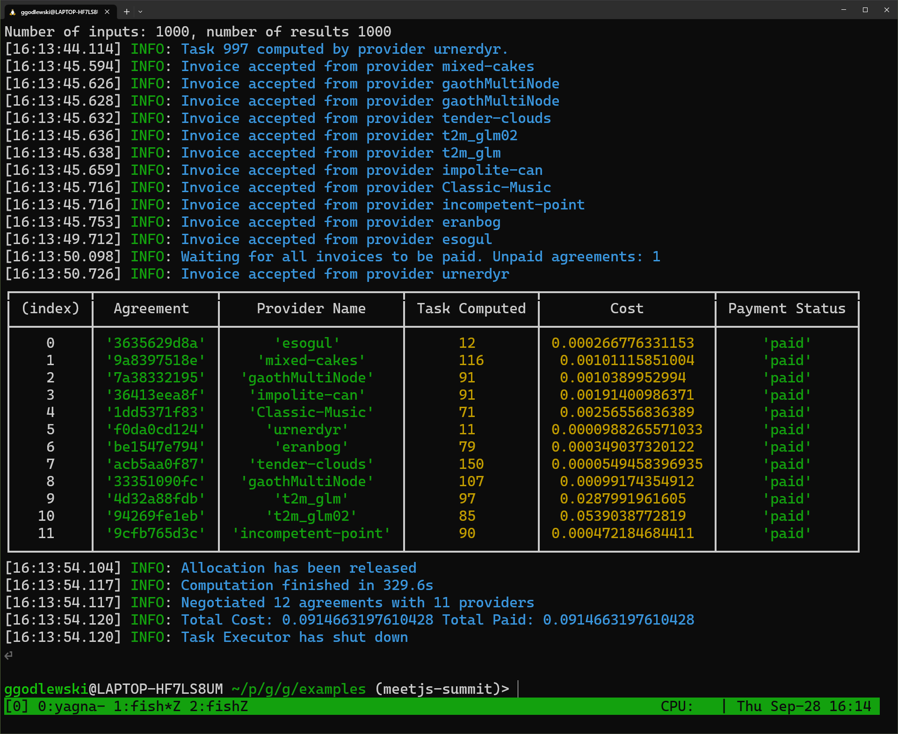
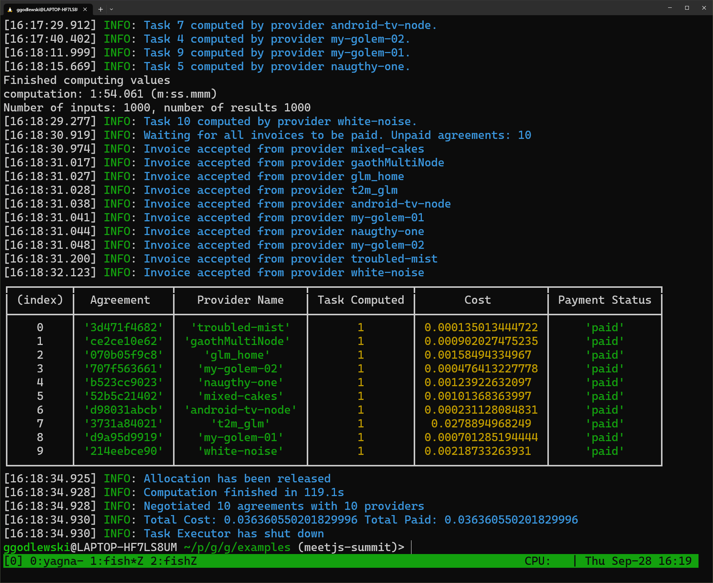

<style>
   img[alt~="center"] {
   display: block;
   margin: 0 auto;
   }
</style>

# Distributed Parallel Computing with JavaScript

## Based on Golem Network

meet.js summit 2023, Wrocław

[//]: # ""

---


# About me

Grzegorz "Grisha" Godlewski

_Technical Lead_
_JS/TS SDK Team @ Golem Factory_

---

# The Problem

- CPU demanding operations which require a lot of time to complete
- Isolated computations - input, converted to output, not many dependencies
- Examples include: calculations, video, audio, image, text processing

---

# Our example

```typescript
import assert from "assert";

export function fib(n: number): number {
  assert(n >= 0, "The fib n param has to be greater than 0");

  if (n === 0) {
    return 0;
  } else if (n === 1 || n === 2) {
    return 1;
  } else {
    return fib(n - 1) + fib(n - 2);
  }
}
```

For `n = 45` computing can take even 2-3 minutes on my machine.

---

# Implementation 1

Linear computation of every value

```typescript
// Contains 10, 50, 100, 500, 1000 or 5000 items...
const inputs = readInputDataSet();

// One by one...
for (const i of inputs) {
  console.log("fib(%d)=%d", i, fib(i));
}

// "Concurrently"...
const tasks = inputs.map((input) => Promise.resolve(fib(input)));
await Promise.all(tasks);
```

---

# Implementation 2

Multi-threading with worker threads (`threads` on NPM)

```typescript
// main.ts
const pool = Pool(() => spawn(new Worker("./threads/fib.worker")));

const inputs: number[] = readInputDataSet();

const tasks = inputs.map((i) =>
  pool.queue((fibWorker) => {
    return fibWorker.compute(i);
  }),
);

const results = await Promise.all(tasks);

console.log(results);

await pool.terminate();
```

---

# Implementation 2 (continued)

```typescript
// threads/fib.worker.ts
import { fib } from "../lib";
import { expose } from "threads/worker";

expose({
  compute(n: number): number {
    return fib(n);
  },
});
```

---

# Overcome the single processor limitation

Some well established options:

- **uService** deployed in many replicas in public or private clouds + **HTTP** LB + scatter gather
- **worker** deployed in many replicas in public or private clouds + **messaging** based RPCs

---


---

# About Golem Network

> Golem **democratizes** society’s access to computing power by creating a **decentralized** platform where anyone can
> build a variety of applications, request computational resources and/or offer their idle systems in exchange for
> cryptocurrency tokens (GLM).

---



---

# Implementation 3

Using `@golem-sdk/golem-js`

```typescript
// main.ts
const config = await makeConfig({
  image: "golem/node:20-alpine",
});

const executor = await TaskExecutor.create(config);

const inputs: number[] = readInputDataSet();
const results = await computeOnGolem(executor, inputs);

console.log(results);

await executor.end();
```

---

# Implementation 3 (continued)

```typescript
export async function makeConfig({
  image = "golem/node:20-alpine",
}: {
  image: string;
}): Promise<ExecutorOptionsMixin> {
  const acceptablePrice = limitPriceFilter({
    start: 0.1,
    cpuPerSec: 0.1 / 3600,
    envPerSec: 0.1 / 3600,
  });

  const verifiedProviders = await getVerifiedProviders();
  const whiteList = whiteListProposalIdsFilter(verifiedProviders);

  return {
    package: image,

    budget: 0.5,

    proposalFilter: async (proposal) =>
      (await acceptablePrice(proposal)) && (await whiteList(proposal)),

    payment: {
      network: "polygon",
    },

    maxTaskRetries: 1,
    maxParallelTasks: 12,

    logLevel: LogLevel.Info,
    taskTimeout: 10 * 60 * 1000,
  };
}
```

---

# Implementation 3 (continued)

```typescript
async function computeOnGolem(executor: TaskExecutor, inputs: number[]) {
  executor.beforeEach((ctx) =>
    ctx.uploadFile(
      __dirname + "/tasks/fib-compute.task.js",
      "/golem/work/fib-compute.task.js",
    ),
  );

  const tasks = inputs.map((input) =>
    executor.run((ctx) =>
      ctx.run(`node /golem/work/fib-compute.task.js ${input}`),
    ),
  );

  return Promise.all(tasks);
}
```

---

# Implementation 3 (outcome)



---

# Implementation 4

```typescript
const config = await makeConfig({
  image: "grisha-golem/node-fib-with-threads:latest",
});

const executor = await TaskExecutor.create(config);

const inputs: number[] = readInputDataSet();
const chunks = chunkDataSet(inputs, 100);
const results = await computeChunksOnGolem(executor, chunks);

console.log(results);

await executor.end();
```

---

# Implementation 4 (continued)

```typescript
async function computeChunksOnGolem(
  executor: TaskExecutor,
  chunks: number[][],
) {
  const tasks = chunks.map(async (inputs, chunkNumber) => {
    const chunkFile = writeChunkFile(chunkNumber, inputs);

    const result = await executor.run(async (ctx) => {
      await ctx.uploadFile(chunkFile, "/golem/work/dataset.json");
      return ctx.run(`node /src/app/dist/index.js`);
    });

    if (result) {
      return result.getOutputAsJson<number[]>();
    }
  });

  const results = await Promise.all(tasks);
  return results.flat();
}
```

---

# Implementation 4 (outcome)



---

# Join the Network as Creator!

Install the SDK:

```shell
npm install --save @golem-sdk/golem-js
```

Or start a project:

```shell
npx @golem-sdk/cli new my-golem-app
```

And consider using publicly available information about healthy Providers.

```shell
npm install --save @golem-sdk/provider-health
```

---

# Selected limitations

We're currently addressing the following limitations:

- Internet access from the Provider is limited (\*)
- VPN and network communication with Providers or between Providers (\*)
- Varying quality or health of Providers (we got you covered!)

# Upcoming features

- React hooks for FE development

---

# Resources


---


# Thanks for listening!

- GitHub: https://github.com/grisha87
- LinkedIn: https://www.linkedin.com/in/ggodlewski/
- Twitter: https://twitter.com/GGodlewski
- Discord: `ggodlewski`
- Mail: [grzegorz@golem.network](mailto:grzegorz@golem.network)

---

# Questions? :-)
