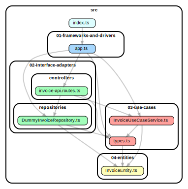

# Clean Architecture Meetup Talk

This project demonstrates a simple implementation of the Clean Architecture approach that was showcased during
[meet.js meetup on 30th Nov 2023 in Wrocław, Poland](https://www.meetup.com/meet-js-wroclaw/events/296989115/).

It is supposed to show how different layers of abstractions from
the [Clean Architecture model](https://blog.cleancoder.com/uncle-bob/2012/08/13/the-clean-architecture.html) described
by R. C. Martin can be mapped to code.

The directory structure refers to these layers in a direct manner, but these could be mapped in the follwing way:

| Name used in the repo     | How it could be named |
| ------------------------- | --------------------- |
| 01-frameworks-and-drivers | boot/core/runtime     |
| 02-interface-adapters     | infrastructure        |
| 03-use-cases              | services              |
| 04-entities               | domain                |

## Building

Feel free to build the project using `npm run build`.

## Usage

### Visualize the code structure thanks to [`dependency-cruiser`](https://www.npmjs.com/package/dependency-cruiser)

Except for the possibility to look at the resulting code, you can visualize how the dependencies are lining up by
running:

```bash
npm run arch:graph
```

Which should generate such a dependency graph:



### Test the architecture and hook it into your CI

There's a NPM script that allows checking if the architectural rules related to dependencies defined
in [dependency-cruiser config](./.dependency-cruiser.js) are not violated.

```bash
npm run arch:validate
```

## Testing

The example was build using Test Driven Development, so you can check out the unit tests and run them:

```bash
npm test -- --collectCoverage
```

Check if the implementation works by running the app in dev mode and issuing a REST request:

```bash
npm run dev
curl -X POST -d '{"orderId":100}' -H 'content-type: application/json' -s http://localhost:3000/invoice | jq
```
