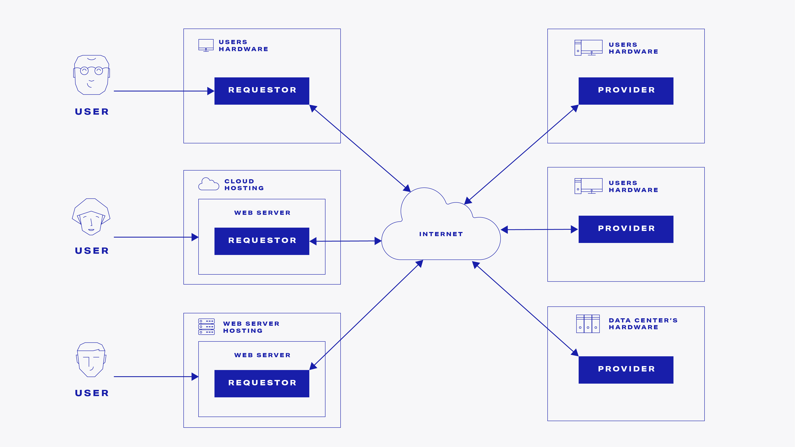

# Golem Network

#### Rozpraszanie zadań obliczeniowych na wiele procesorów

---

# O mnie

Grzegorz Godlewski

- LinkedIn: https://www.linkedin.com/in/ggodlewski/
- Twitter: https://twitter.com/GGodlewski
- Discord: `ggodlewski`
- Mail: [grzegorz@golem.network](mailto:grzegorz@golem.network)

---
# Agenda

- O projekcie Golem Network
- Przykłady zastosowań
- Deep dive
- Sesja Q&A

---
# Czym jest Golem Network?

> Golem **democratizes** society’s access to computing power by creating a **decentralized** platform where anyone can build a variety of applications, request computational resources and/or offer their idle systems in exchange for cryptocurrency tokens (GLM).

---
# Czym jest Golem Network?

* Jest rozwiązaniem OpenSource
* Decentralizacja i wolność dostępu są podstawowymi wartościami

---
# Disclaimer

Mówimy tutaj o tokenach ER20 (_tokenach krypto_), ale uwaga:

> Przekazywane w trakcie tej prezentacji informajce nie mogą być traktowane jako porada inwestycyjna lub wiążąca ocena rynku albo instrumentu inwestycyjnego.

---

---
# Jaki jest stan projektu na dzisiaj?

[https://stats.golem.network](https://stats.golem.network)
[https://portal.golem.network](https://portal.golem.network)
Discord ➡ `#golem-projects`

---
# Dlaczego dla mnie?

---
# User Story

> As a user,
> I want to provide my unused computing power,
> so that I can get some of that power back later

---
# Przykład 1: Hello World

---
# Przykład 2: Własny skrypt

---
# Przykład 3: Scatter-gather

---
# Przykład 4: Utility - konwersja obrazu na tekst

---
# Jak to jest zrobione?

---

---

---

---
# Jak zacząć jako twórca?

1. Zacznij od instalacji SDK:
   `npm i @golem-sdk/golem-js`

2. Przeczytaj handbook aby poznać Golem
   [https://handbook.golem.network/](https://handbook.golem.network/)

3. Przeczytaj dokumentację dla developerów JS
   [https://docs.golem.network/creators/javascript/quickstart/](https://docs.golem.network/creators/javascript/quickstart/)

4. Zapoznaj się z przykładami w repozytorium
   [https://github.com/golemfactory/golem-js/tree/master/examples](https://github.com/golemfactory/golem-js/tree/master/examples)

5. Dołącz do naszego [serwera Discord](https://chat.golem.network/),
   SDK ➡ `#js-discussion`

---
# Wybrane ograniczenia

* Różna jakość providerów, fault handling i resiliency konieczne
* Providerzy mają różnej jakości łącza internetowe

---
# Nad czym pracujemy

* Dostęp do internetu z poziomu providera
* Toolchain ułatwiający tworzenie aplikacji na Golem
* Kanały dystrybucji: `latest`, `beta`, `alpha`
* Polityka dotycząca zgodności wstecznej

---
# Pytania?

---
# Zasoby

---
# Dziękuję!
